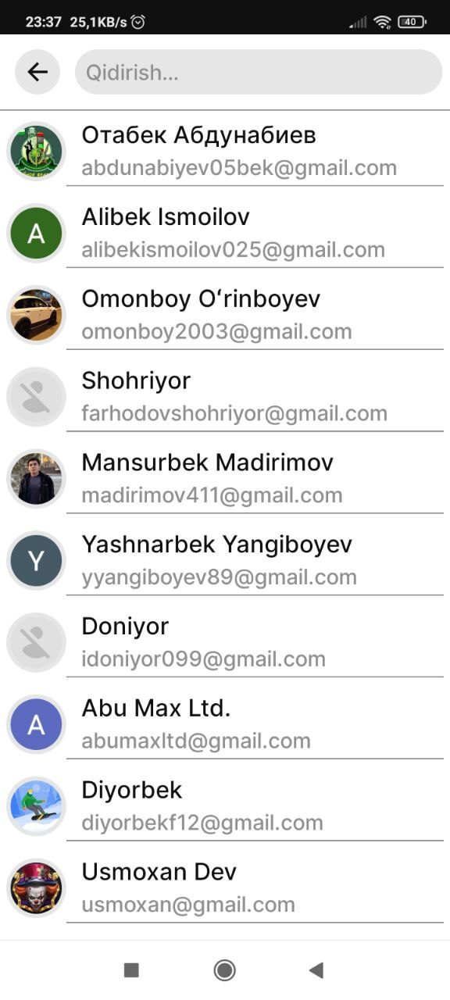
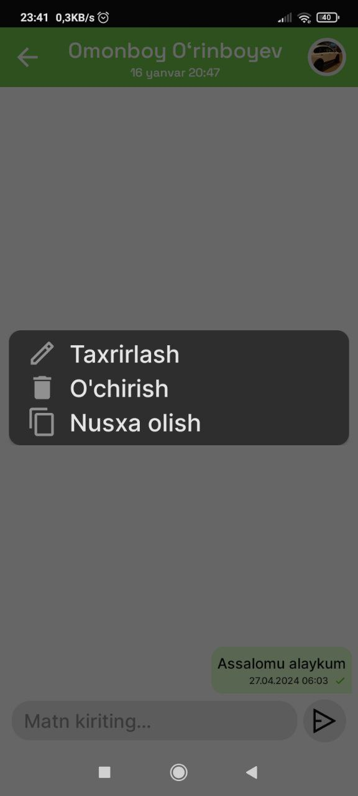
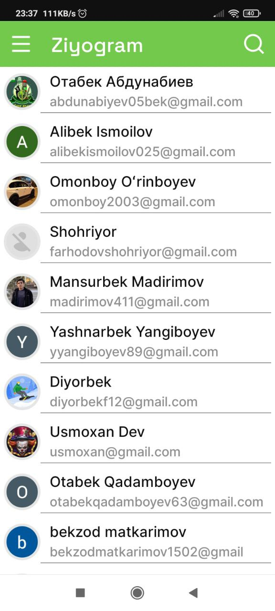

<p float="left">
  
  
  
  
</p>

# Ziyogram

"Ziyogram" is an application for [chat app to chat with friends].

## Features

- **Find Friends** - Search for your friends in the search section
- **Send Message** - Send messages
- **Delete Message** - Delete messages
- **Edit Message** - Edit messages
- **Last Activity** - View the user's last activity

## Installation

To clone this repository, use the following command:

```bash
git clone https://github.com/ZikrullaYashinov/Ziyogram
```

# Ziyogram

"Ziyogram" - bu ilova [do‘stlaringiz bilan chatda muloqot qilishingiz uchun].

## Xususiyatlar

- **Do'stlar qidirish** - Qidirish bo'limidan do'stlaringizni qidirish  
- **Xabar yozish** - Xabarlar yozish
- **Xabarni o'chirish** - Xabarni o'chirish
- **Xabarni taxrirlash** - Xabarni taxrirlash
- **Oxirgi faollik** - Foydalanuvchining oxirgi faolligi

## O'rnatish

Loyihani klonlab olish uchun quyidagi buyruqdan foydalaning:

```bash
git clone https://github.com/ZikrullaYashinov/Ziyogram
```
